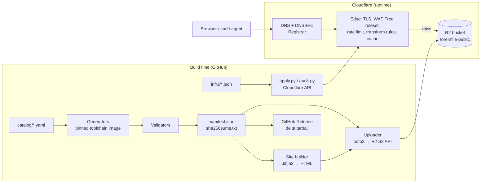

# 02 — Architecture

## 1. Principle

**Static objects behind a CDN, nothing else.** Every request is answered by Cloudflare's edge cache or, on a miss, by Cloudflare R2 object storage. There is no origin server, no runtime code, no database and no write path. All intelligence lives at build time (GitHub Actions) and in Cloudflare's declarative rules.

## 2. Component diagram



## 3. Request flow (runtime)

1. Client resolves `loremfile.dev` (DNSSEC-signed, Cloudflare nameservers). The apex is the R2 bucket's custom domain; Cloudflare manages the proxied record.
2. TLS terminates at Cloudflare. `.dev` is on the HSTS preload list, so plain HTTP never reaches a client.
3. Request phases, in Cloudflare's fixed order (see `08-infrastructure.md` §5 for the exact rules):
   - **Single Redirect** (`http_request_dynamic_redirect`): `www.loremfile.dev/*` → 301 to apex. This phase runs before URL normalization, so the redirect forwards the raw path; the apex request is then normalized and evaluated by every later rule as usual.
   - **URL normalization** (`http_request_sanitize`, Cloudflare-managed, must stay on): percent-decodes and normalizes the path before rules see it.
   - **URL Rewrite** (`http_request_transform`): path `/` → `/index.html`. Paths ending in `/` → `…/index.html`.
   - **Rate limiting** (`http_ratelimit`): 300 requests / 10 s per client IP → block 10 s. Runs before the managed WAF.
   - **WAF managed rules** (`http_request_firewall_managed`): Cloudflare Free Managed Ruleset.
   - **Cache rule** (`http_request_cache_settings`): everything is cache-eligible; the cache key ignores the query string; TTL follows the object's `Cache-Control`.
4. Cache HIT → served from the edge (no R2 operation, no cost). Cache MISS → R2 GET (one Class B operation), stored at the edge.
5. **Response header transform** adds security headers (different sets for fixtures, active-content fixtures, and site pages).
6. CORS headers come from the bucket's CORS policy, applied by R2 for requests carrying `Origin`.

## 4. Object layout in the bucket

| Key pattern | What | Content-Type | Cache-Control |
|---|---|---|---|
| `{format}/{name}` | Fixture bytes (each `{format}/` prefix is covered by an indefinite R2 bucket-lock rule, so the storage layer refuses overwrites and deletes) | from catalog | `public, max-age=31536000, immutable, no-transform` |
| `{format}/index.json` | Per-format manifest subset | `application/json` | `public, max-age=300, must-revalidate` |
| `{format}` (no slash, no extension) and `{format}/index.html` | Format landing page | `text/html; charset=utf-8` | `public, max-age=300, must-revalidate` |
| `index.html`, `docs/…`, `legal/…`, `changelog` | Site pages (extensionless keys) | `text/html; charset=utf-8` | `public, max-age=300, must-revalidate` |
| `assets/site.css`, `assets/site.js`, `assets/*.svg` | Site assets (content-hashed names) | per type | `public, max-age=31536000, immutable` |
| `manifest.json`, `sha256sums.txt`, `formats.json`, `search-index.json`, `llms.txt`, `llms-full.txt`, `sitemap.xml`, `robots.txt` | Discovery files | per type | `public, max-age=300, must-revalidate` |
| `favicon.ico`, `apple-touch-icon.png` | Browser icons (generated from the brand mark at build; without them every page view triggers a 404 read) | `image/x-icon`, `image/png` | `public, max-age=86400` |
| `formats`, `status`, `changelog`, `docs`, `legal` | Site pages (extensionless keys) | `text/html; charset=utf-8` | `public, max-age=300, must-revalidate` |
| `schema/manifest-v1.json` | JSON Schema (immutable once published) | `application/schema+json` | `public, max-age=31536000, immutable` |
| `assets/og.png`, `assets/mark.svg` | Social image, brand mark | `image/png`, `image/svg+xml` | `public, max-age=86400` |
| `.well-known/security.txt` | RFC 9116 | `text/plain; charset=utf-8` | `public, max-age=86400` |
| `_probe/*` | Exists only while `infra.yml` probe mode runs (M2.4) | — | — |

Why each format page exists twice (`pdf` and `pdf/index.html`): R2 has no directory-index behaviour, so `/pdf` is served by an object literally named `pdf`, while `/pdf/` is rewritten to `pdf/index.html` by a transform rule. Both are uploaded from the same rendered HTML (see ADR-006).

## 5. Build-time pipeline

```mermaid
sequenceDiagram
  participant PR as Pull request
  participant CI as ci.yml
  participant MAIN as deploy.yml (main)
  participant R2 as R2 bucket
  participant CF as Cloudflare API
  PR->>CI: lint, unit tests
  CI->>CI: build --new (fixtures absent from origin/main manifest)
  CI->>CI: validate (magic bytes, parsers, props, size class, policy scan)
  CI->>CI: manifest check (published entries unchanged; new entries match regenerated bytes)
  CI->>CI: build site, link-check, schema-validate manifest
  MAIN->>MAIN: build --missing-in-bucket, validate, manifest check (never rewrites the manifest)
  MAIN->>R2: upload NEW fixture keys only (refuse overwrite); delete tombstoned keys
  MAIN->>R2: upload site + discovery keys (overwrite allowed)
  MAIN->>CF: purge site/discovery URLs (batches)
  MAIN->>MAIN: verify_live.py smoke
  MAIN->>CF: audit.py (drift report); apply.py only when infra/ changed
```

## 6. Trust boundaries

| Boundary | Trusted side | Untrusted side | Control |
|---|---|---|---|
| Internet → Cloudflare edge | Cloudflare | Any client | TLS, WAF, rate limit, DDoS, cache |
| GitHub Actions → Cloudflare/R2 | Workflow on `main` | Pull requests from forks | Secrets only on `main` in `production` environment; PR workflows have no secrets |
| Contributor → repository | Maintainer review | PR author | Branch protection, required CI (CODEOWNERS is informational while there is one maintainer) |
| Toolchain image → generated bytes | Pinned digest | Upstream packages | Digest pinning, hash-pinned Python deps, Dependabot review |

## 7. Why not the alternatives (summary; details in ADRs)

| Alternative | Rejected because |
|---|---|
| Cloudflare Worker in front of everything | Every request would be a Worker invocation: 100,000/day cap on Free, then USD 5/month + per-million fees. Adds code to maintain. Worker routes are reserved for specific dynamic paths in Phase 3 (ADR-003). |
| Cloudflare Pages for the site + R2 on a subdomain | Two deploy systems; fixture URLs would need a subdomain (`cdn.loremfile.dev/…`), which is worse for the core use case (ADR-002). |
| AWS S3 + CloudFront | Egress is billed; more accounts to secure; no benefit (ADR-004). |
| Vercel | Static hosting fine, but file egress limits and a second platform; unnecessary (ADR-004). |
| Committing fixture binaries to git / Git LFS | Repo bloat; LFS bandwidth quotas; instead the manifest is the lock and GitHub Releases archive bytes (ADR-007). |
| Terraform for Cloudflare | State management overhead for a one-zone project; replaced by idempotent desired-state JSON + `apply.py`/`audit.py` (ADR-008). Terraform remains an acceptable substitute. |

## 8. Capacity and limits that shape the design

| Limit | Value (verified 2026-09-06/07) | Design response |
|---|---|---|
| R2 free tier | 10 GB storage, 1M Class A, 10M Class B ops/month, free egress | Stay ≤ 8 GB; cache everything; new uploads only |
| Cloudflare cacheable file size (Free) | 512 MB | Fixture cap 100 MB |
| Transform rules (Free) | 10 active, no regex | 5 used (2 URL rewrites + 3 response-header rules), 6 with the optional response-type CSP rule; only `eq`, `ne`, `starts_with`, `ends_with`, `contains`, `concat`. The `www` redirect is a Single Redirect (separate quota of 10) |
| Rate limiting (Free) | 1 rule; period 10 s; mitigation 10 s; characteristic IP (`ip.src` plus the API-mandatory `cf.colo.id`); fields Path & Verified Bot | One zone-wide rule 300/10 s per IP per data centre |
| Cache key customisation (Free) | Can ignore or sort the query string; cannot exclude the `Origin` header or add headers/cookies (Enterprise) | Cache rule ignores the query string; per-origin cache entries are accepted and bounded by Tiered Cache |
| Workers Free | 100,000 requests/day | No Worker in the request path |
| GitHub Actions | Free for public repositories on standard runners | Public repo |
